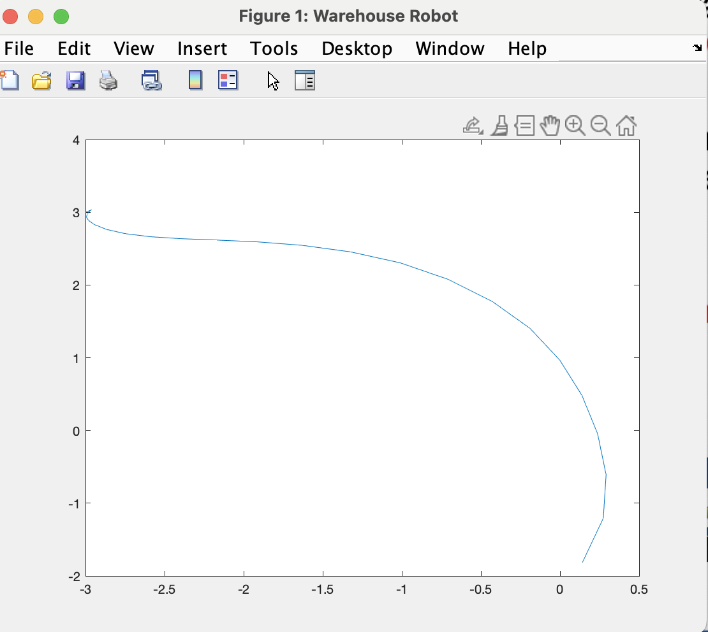
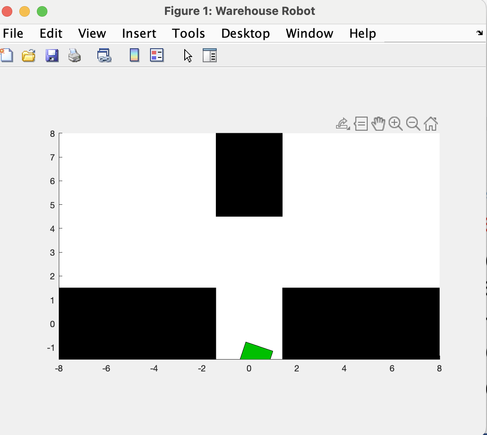
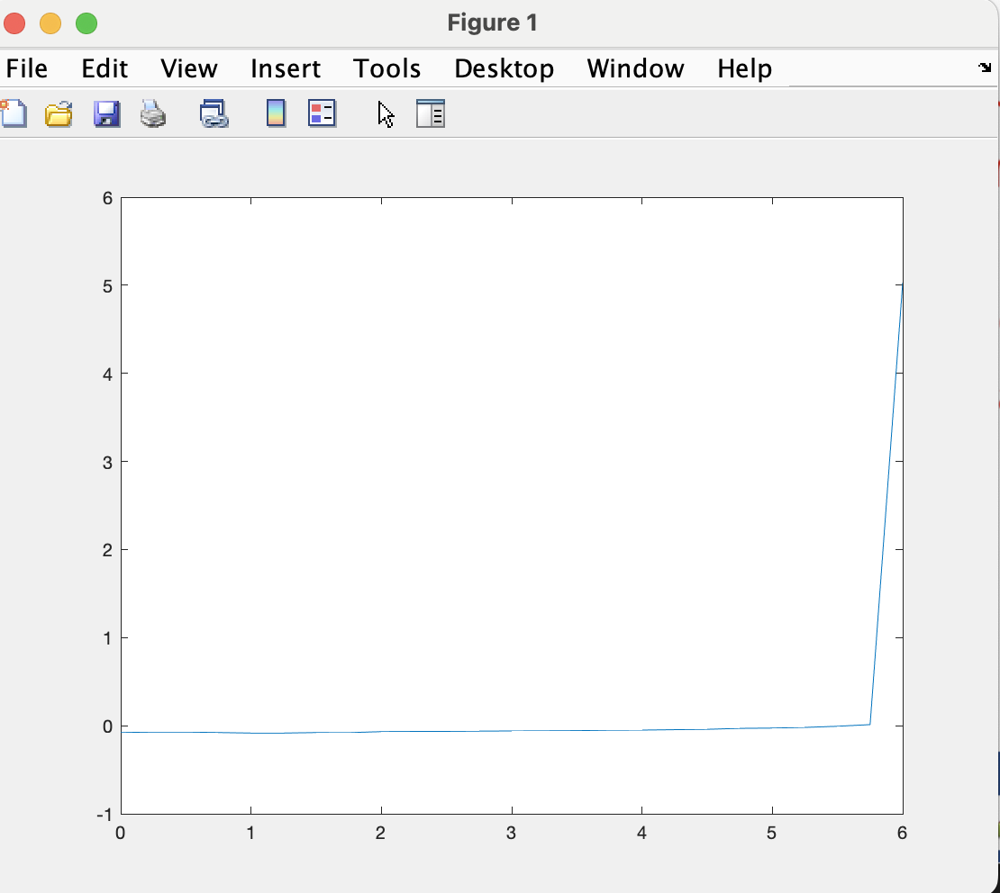
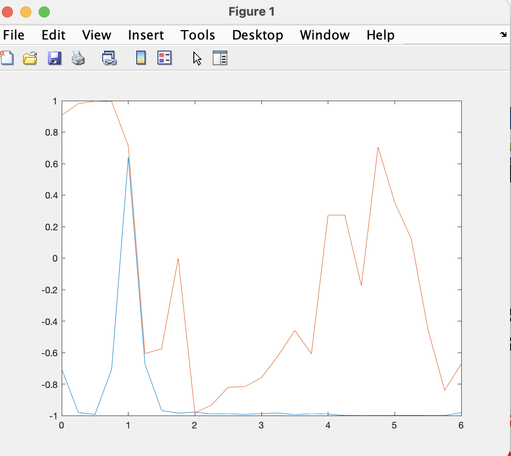

**Title: Analysis of Reinforcement Learning Simulation for Robotic Control**

**Introduction:**
The provided MATLAB code is an implementation and analysis of a reinforcement learning (RL) simulation for robotic control. The simulation uses a DDPG (Deep Deterministic Policy Gradient) agent to control a robotic system represented by a Simulink model.

**Code Overview:**
1. **Initialization:** The code starts by initializing the random number generator, loading the robot model, and creating a DDPG agent and a Simulink environment.

```matlab
rng(123)
load robotmodel
agent = rlDDPGAgent(...);
env = SimulinkEnvWithAgent(...);
```

2. **Simulation:** The main simulation is performed using the `sim` function, where the DDPG agent interacts with the Simulink environment. The simulation results are stored in the `simout` variable.

```matlab
simout = sim(agent, env);
```

3. **Data Extraction:** The code then extracts observation, action, and reward data from the simulation results.

```matlab
obs = simout.Observation.obs1.Data;
act = squeeze(simout.Action.act1.Data);
reward = simout.Reward.Data;
```

4. **Plotting:** The extracted data is plotted to visualize the system's behavior over time. The position and orientation of the robot, agent actions, and rewards are plotted against simulation time.

```matlab
x = obs(1,:);
y = obs(2,:);
plot(x, y); % Plot robot position
plot(t, obsmat(6,:)); % Plot agent actions
plot(t, reward); % Plot reward over time
```

**Analysis:**
1. **Observation Data:** The plotted robot position shows a trajectory over time, indicating the robot's movement in the environment.

2. **Action Data:** The agent's actions, specifically translational and rotational forces, are plotted against time. This provides insights into how the agent controls the robot.

3. **Reward Data:** The reward plot shows the reinforcement signals received by the agent during the simulation. Analyzing reward trends can provide information about the agent's learning performance.

**Error Handling:**
There are a couple of errors in the code related to incorrect variable names, such as using 'environment' instead of 'env'. Additionally, there's an indexing error in the loop iterating over simulations (`for k = 1:10`), where the loop index exceeds the number of simulations in the `simout` array.

**Recommendations:**
1. Correct variable names and indexing errors to ensure the code runs without issues.
2. Consider adding comments to explain specific sections of the code for better readability.
3. Extend the analysis by including additional metrics or visualizations, such as exploration-exploitation trade-off and learning curves.

**Conclusion:**
The provided MATLAB code successfully implements a reinforcement learning simulation for robotic control using a DDPG agent. However, attention to error correction and additional analysis could enhance the code's clarity and comprehensiveness.





