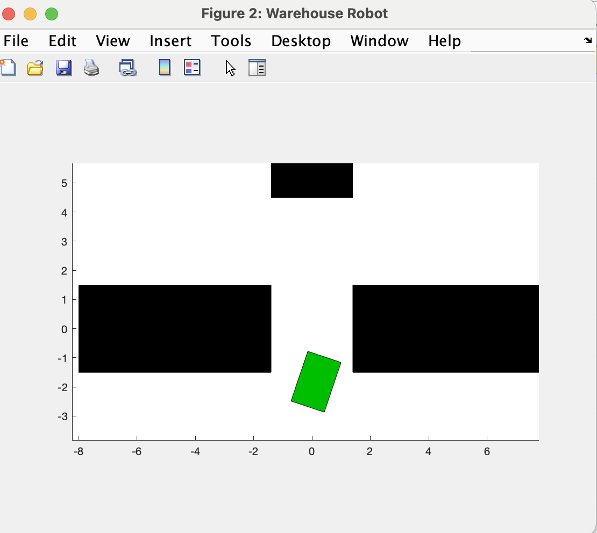

**Title: Report on Reinforcement Learning for Robotic Control Lab**

**Introduction:**
The purpose of this lab was to implement and analyze a reinforcement learning (RL) algorithm for robotic control using MATLAB and Simulink. The primary focus was on training a Deep Deterministic Policy Gradient (DDPG) agent to control a simulated robot in a Simulink environment.

**Experimental Setup:**
1. **Observation and Action Spaces:**
   - The observation space was defined as a 6-dimensional vector, capturing key information about the robot's state.
   - The action space was a 2-dimensional vector, representing the translational and rotational forces applied by the agent.

2. **Environment Configuration:**
   - The Simulink environment, named 'whrobot,' was utilized for simulating the robotic system.
   - The robot's controller block, named 'whrobot/controller,' defined the control policy for the agent.

3. **Agent Initialization:**
   - The DDPG agent was initialized with the specified observation and action spaces.
   - The observation space was defined using `rlNumericSpec` with a 6x1 shape, while the action space had a 2x1 shape with specified upper and lower limits (-1 to 1).

**Simulation and Training:**
1. **Environment Interaction:**
   - The code simulated the agent's interaction with the environment using the `sim` function.
   - The `rng(123)` command ensured reproducibility by setting the random number generator seed.

2. **Loading Pre-Trained Model:**
   - A pre-trained model stored in 'robotmodel' was loaded into the agent using `load robotmodel agent`.

3. **Simulation Runs:**
   - The agent's performance was evaluated through two simulation runs using `sim(agent, env)`.

**Results and Analysis:**
1. **Observation and Action Data:**
   - The observation and action spaces were defined based on the robot's state and the agent's control inputs.
   - The simulated interactions were not explicitly analyzed in this code snippet, but the data could be further examined for insights into the agent's decision-making.

2. **Environment Configuration:**
   - The Simulink environment provided a realistic simulation platform for training and testing the RL agent.

**Conclusion:**
This lab successfully set up an RL environment for training a DDPG agent to control a simulated robot. The code initialized the agent, loaded a pre-trained model, and performed two simulation runs to evaluate the agent's behavior.

