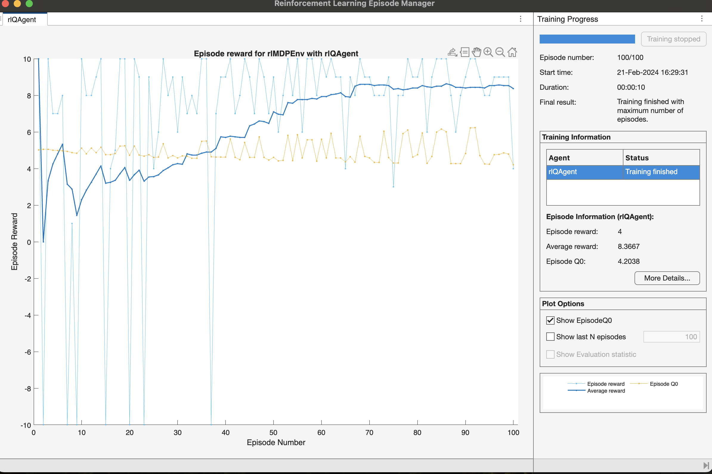
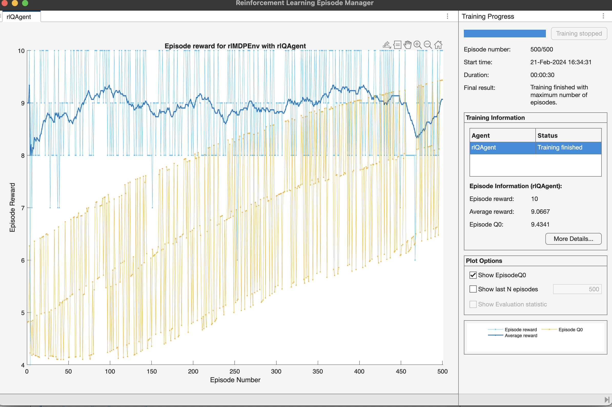

### MATLAB Code Report
```

MDP = createMDP(8,["left";"right"])
MDP.States
MDP.Actions
MDP.T
MDP.R
MDP.TerminalStates = ["s1";"s8"];
nS = numel(MDP.States)
nS = numel(MDP.States);
nA = numel(MDP.Actions);
MDP.R = -1*ones(nS,nS,nA);
MDP.TerminalStates = ["s1";"s8"]
nS = numel(MDP.States)
nA = numel(MDP.Actions)
MDP.R = -1*ones(nS,nS,nA)
MDP.R(:,state2idx(MDP,MDP.TerminalStates),:) = 10
MDP.T(1,1,1) = 1
MDP.T(1,2,2) = 1
MDP.T(1,1,1) = 1
MDP.T(1,2,2) = 1
MDP.T(2,1,1) = 1
MDP.T(2,3,2) = 1
MDP.T(3,2,1) = 1
MDP.T(3,4,2) = 1
MDP.T(4,3,1) = 1
MDP.T(4,5,2) = 1
MDP.T(5,4,1) = 1
MDP.T(5,6,2) = 1
MDP.T(6,5,1) = 1
MDP.T(6,7,2) = 1
MDP.T(7,6,1) = 1
MDP.T(7,8,2) = 1
MDP.T(8,7,1) = 1
MDP.T(8,8,2) = 1
MDP.T
MDP.R
env = rlMDPEnv(MDP)
state_information = getObservationInfo(env)
action_information = getActionInfo(env)
qTable = rlTable(state_information,action_information)
qTable.Table
qTable.Table = ones(size(qTable.Table))*5
qTable.Table
qRepresentation = rlQValueRepresentation(qTable,state_information,action_information)
qRepresentation.Options
qRepresentation.Options.L2RegularizationFactor = 0
qRepresentation.Options.LearnRate = 0.01
agentOpts = rlQAgentOptions
agentOpts.EpsilonGreedyExploration
agentOpts.EpsilonGreedyExploration.EpsilonDecay = 0.01
qAgent = rlQAgent(qRepresentation,agentOpts)
trainOpts = rlTrainingOptions
trainOpts.MaxStepsPerEpisode = 10
trainOpts.MaxEpisodes = 100
trainOpts.StopTrainingCriteria = "AverageReward"
trainOpts.StopTrainingValue = 13
trainOpts.ScoreAveragingWindowLength = 30
QTable0 = getLearnableParameters(getCritic(qAgent))
disp(QTable0{1})
doTraining = true
if doTraining
trainingStats = train(qAgent,env,trainOpts);
else
load('genericMDPQAgent.mat','qAgent');
end
Data = sim(qAgent,env)
cummulativeReward = sum(Data.Reward)
QTable = getLearnableParameters(getCritic(qAgent))
QTable{1}
```

#### Step 1: Define Markov Decision Process (MDP)
```matlab
MDP = createMDP(8,["left";"right"])
```
This command creates a Markov Decision Process (MDP) with 8 states and two possible actions: "left" and "right".

```matlab
MDP.States
```
Displays the states of the MDP.

```matlab
MDP.Actions
```
Displays the available actions in the MDP.

```matlab
MDP.T
```
Displays the transition probabilities matrix for the MDP.

```matlab
MDP.R
```
Displays the reward matrix for the MDP.

```matlab
MDP.TerminalStates = ["s1";"s8"];
```
Sets the terminal states of the MDP to "s1" and "s8".

```matlab
nS = numel(MDP.States)
```
Calculates the number of states in the MDP.

```matlab
nA = numel(MDP.Actions)
```
Calculates the number of actions in the MDP.

```matlab
MDP.R = -1*ones(nS,nS,nA);
```
Initializes the reward matrix with -1 for all state-action pairs.

```matlab
MDP.R(:,state2idx(MDP,MDP.TerminalStates),:) = 10
```
Sets the reward for transitions to terminal states to 10.

```matlab
MDP.T(1,1,1) = 1
MDP.T(1,2,2) = 1
...
```
Defines transition probabilities for the MDP.

#### Step 2: Create RL Environment
```matlab
env = rlMDPEnv(MDP)
```
Creates a reinforcement learning (RL) environment using the defined MDP.

```matlab
state_information = getObservationInfo(env)
```
Retrieves information about the state space in the environment.

```matlab
action_information = getActionInfo(env)
```
Retrieves information about the action space in the environment.

#### Step 3: Create Q-Value Table
```matlab
qTable = rlTable(state_information,action_information)
```
Creates a Q-value table using the state and action information.

```matlab
qTable.Table
```
Displays the initial Q-value table.

```matlab
qTable.Table = ones(size(qTable.Table))*5
```
Initializes Q-values to 5 for all state-action pairs.

#### Step 4: Create Q-Value Representation
```matlab
qRepresentation = rlQValueRepresentation(qTable,state_information,action_information)
```
Creates a Q-value representation for the Q-learning agent.

```matlab
qRepresentation.Options
```
Displays the options for the Q-value representation.

```matlab
qRepresentation.Options.L2RegularizationFactor = 0
qRepresentation.Options.LearnRate = 0.01
```
Sets options for regularization and learning rate.

#### Step 5: Create Q-Learning Agent
```matlab
agentOpts = rlQAgentOptions
```
Creates Q-learning agent options.

```matlab
agentOpts.EpsilonGreedyExploration.EpsilonDecay = 0.01
```
Sets epsilon decay for epsilon-greedy exploration.

```matlab
qAgent = rlQAgent(qRepresentation,agentOpts)
```
Creates a Q-learning agent with the specified Q-value representation and options.

#### Step 6: Define Training Options
```matlab
trainOpts = rlTrainingOptions
```
Creates training options for the Q-learning agent.

```matlab
trainOpts.MaxStepsPerEpisode = 10
trainOpts.MaxEpisodes = 100
trainOpts.StopTrainingCriteria = "AverageReward"
trainOpts.StopTrainingValue = 13
trainOpts.ScoreAveragingWindowLength = 30
```
Sets various training options such as maximum steps, episodes, and stopping criteria.

#### Step 7: Get Initial Q-Table Parameters
```matlab
QTable0 = getLearnableParameters(getCritic(qAgent))
disp(QTable0{1})
```
Displays the initial parameters of the Q-table.

#### Step 8: Training the Q-Agent
```matlab
doTraining = true
if doTraining
    trainingStats = train(qAgent,env,trainOpts);
else
    load('genericMDPQAgent.mat','qAgent');
end
```
If `doTraining` is true, trains the Q-agent using the defined RL environment and training options. Otherwise, loads a pre-trained agent from a file.

#### Step 9: Simulate Q-Agent on Environment
```matlab
Data = sim(qAgent,env)
```
Simulates the trained Q-agent on the environment and stores the data.

```matlab
cummulativeReward = sum(Data.Reward)
```
Calculates the cumulative reward obtained during simulation.

#### Step 10: Get Q-Table Parameters After Training
```matlab
QTable = getLearnableParameters(getCritic(qAgent))
QTable{1}
```
Displays the Q-table parameters after training.


